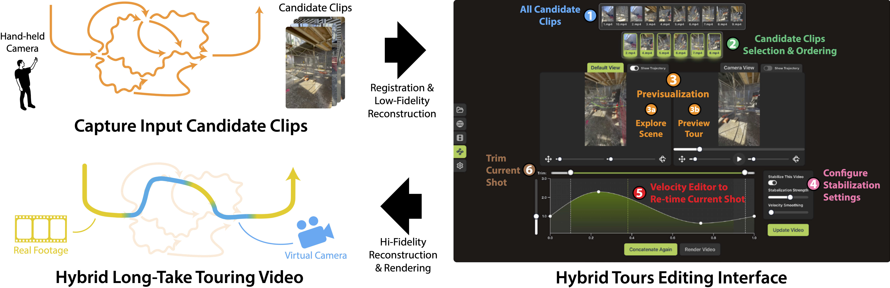
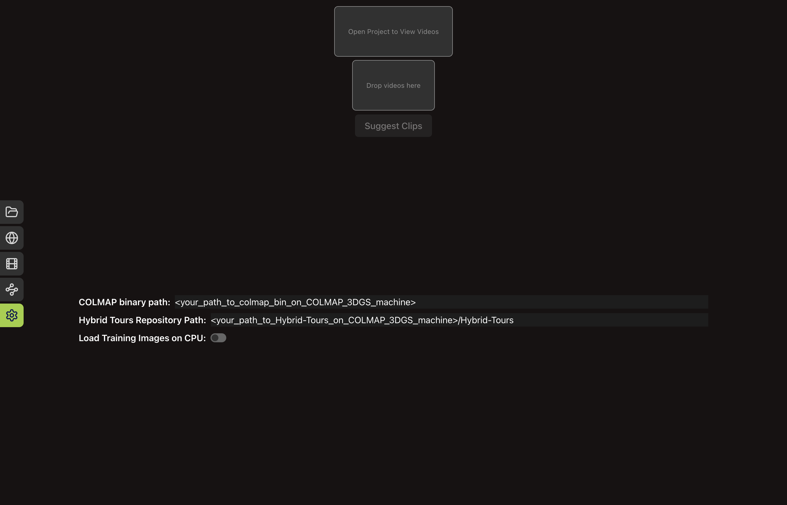
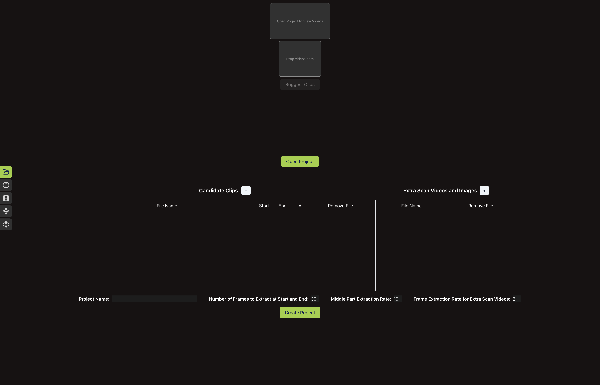
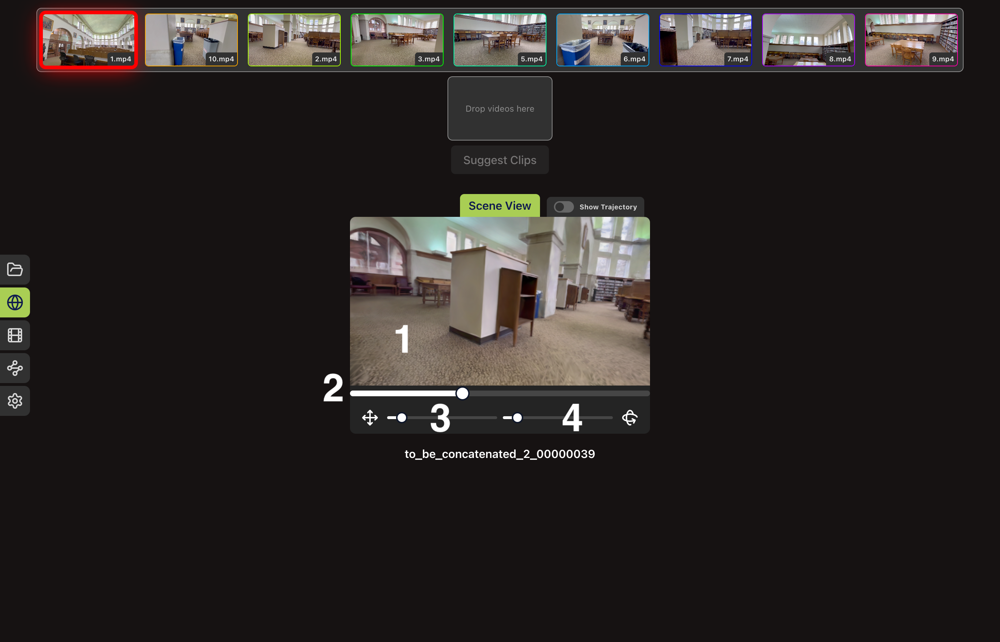
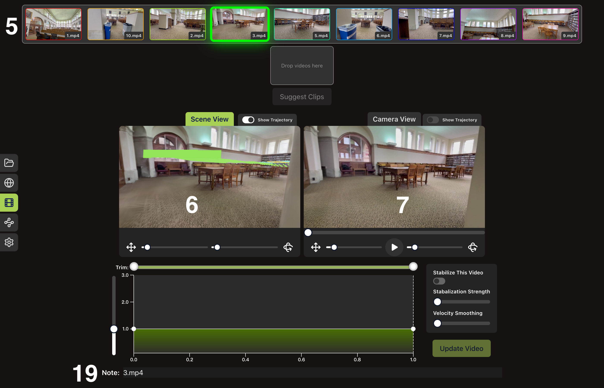
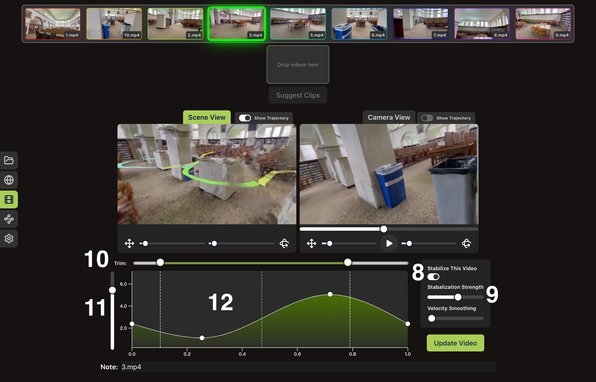
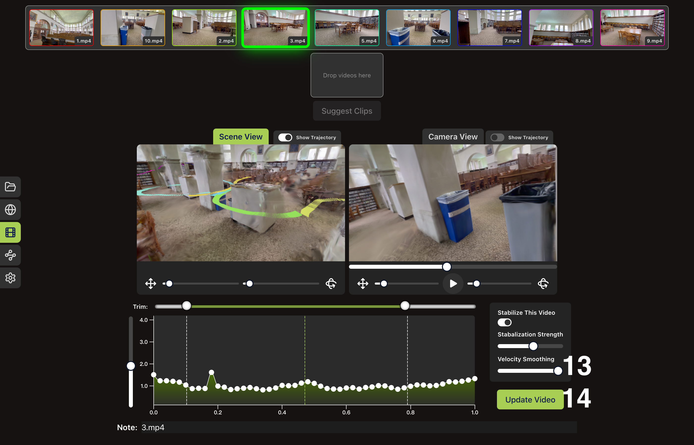
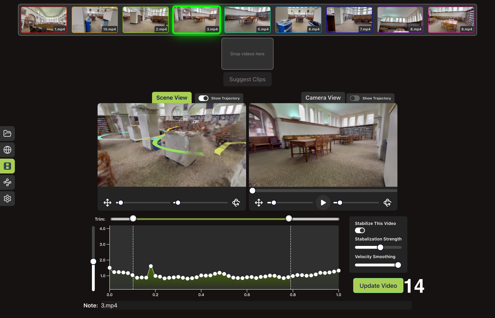
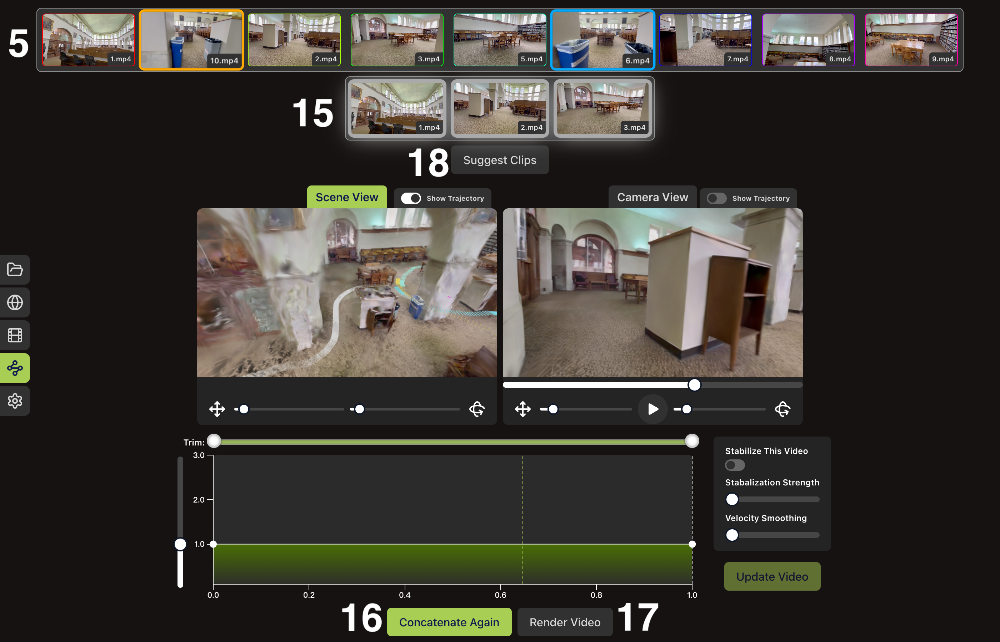

# Hybrid Tours: A Clip-based System for Authoring Long-take Touring Shots

[Xinrui Liu](https://liuxr0831.github.io/), Longxiulin Deng, [Abe Davis](https://abedavis.com)

[Paper - 108.9 MB](https://www.cs.cornell.edu/abe/projects/hybridtours/Hybrid_Tours_HQ.pdf) | [Paper (Compressed) - 3.6 MB](https://www.cs.cornell.edu/abe/projects/hybridtours/Hybrid_Tours_Compressed.pdf) | [Supplemental](https://dl.acm.org/doi/10.1145/3731423) | [Video - Coming Soon...]() | [Webpage - Coming Soon...]()



Abstract: Long-take touring (LTT) shots are characterized by smooth camera motion over a long distance that seamlessly connects different views of the captured scene. These shots offer a compelling way to visualize 3D spaces. However, filming LTT shots directly is very difficult, and rendering them based on a virtual reconstruction of a scene is resource-intensive and prone to many visual artifacts. We propose Hybrid Tours, a hybrid approach to creating LTT shots that combines the capture of short clips representing potential tour segments with a custom interactive application that lets users filter and combine these segments into longer camera trajectories. We show that Hybrid Tours makes capturing LTT shots much easier than the traditional single-take approach, and that clip-based authoring and reconstruction leads to higher-fidelity results at a lower cost than common image-based rendering workflows.

<br>

Since our workflow involves running COLMAP and 3D Gaussian Splatting (3DGS), which requires a lot of computational resource and might need to be run on another machine or a server, our environment setup process involves setting up two different environments, one for running COLMAP and 3D Gaussian splatting and the other for running Hybrid Tours editing interface.

*(Windows only)* If you want to use Windows machines, please do everything here in Git Bash. DO NOT use Powershell.

<br>

## 1. Environment setup

### 1.1 Install conda, npm, and 3DGS Prerequisites

On the machine that you plan to run COLMAP and 3DGS, *if you already have conda and [3DGS prerequisites](https://github.com/graphdeco-inria/gaussian-splatting?tab=readme-ov-file#optimizer) installed, you can skip this step.* Otherwise, install [conda](https://conda.io/projects/conda/en/latest/user-guide/install/index.html) and [3DGS prerequisites](https://github.com/graphdeco-inria/gaussian-splatting?tab=readme-ov-file#optimizer) (which includes CUDA and related libraries). Also, please make sure that your shell is properly configured for conda.

On the machine that you plan to run the Hybrid Tours editing interface, *if you already have [npm](https://docs.npmjs.com/downloading-and-installing-node-js-and-npm) installed, you can skip this step.* Otherwise, please install [npm](https://docs.npmjs.com/downloading-and-installing-node-js-and-npm) and configure your shell properly for running [npm](https://docs.npmjs.com/downloading-and-installing-node-js-and-npm).

### 1.2 Install COLMAP and Setup 3DGS environment

On the machine that you plan to run COLMAP and 3DGS, *if you already have [COLMAP](https://colmap.github.io/install.html#)>=3.8 installed, you can skip this step.* Otherwise, install [COLMAP](https://colmap.github.io/install.html#) to your computer's base environment. If you encounter any trouble installing COLMAP, please refer to [COLMAP's official repository](https://github.com/colmap/colmap/issues) for help. 

On the machine that you plan to run COLMAP and 3DGS, please make sure you meet [all the hardware and software requirements](https://github.com/graphdeco-inria/gaussian-splatting?tab=readme-ov-file#optimizer). Then, clone the Hybrid Tours repository and all of its submodules and use conda to create the environemnt for 3DGS. If you encounter any issue, please refer to [3DGS's official repository](https://github.com/graphdeco-inria/gaussian-splatting/issues) for help.

```shell
git clone --recurse-submodules https://github.com/liuxr0831/Hybrid-Tours.git
SET DISTUTILS_USE_SDK=1 # Windows only
cd Hybrid-Tours/gaussian-splatting
conda env create --file environment_3DGS.yml
```

If everything works without error, you should see ```Python 3.7.13``` if you run the commands below. Otherwise, please configure the alias of ```python3``` properly for your terminal.

```shell
conda activate gaussian_splatting
python3 --version
```

### 1.3 Clone Hybrid Tours Repository

If you plan to run Hybrid Tours editing interface on the same machine you run COLMAP and 3DGS, cd to the Hybrid Tours repository folder.

```shell
cd <UI_machine>/Hybrid-Tours
```

Otherwise, on the machine that you plan to run Hybrid Tours editing interface, clone the repository and all of its submodules.

```shell
git clone --recurse-submodules https://github.com/liuxr0831/Hybrid-Tours.git
cd Hybrid-Tours
```

### 1.4 Setup Hybrid Tours environment

Inside ```<UI_machine>/Hybrid-Tours```, create the Hybrid Tours environment and install all dependencies for backend and frontend.

```shell
conda env create --file environment_Hybrid_Tours.yml
npm install
```

If everything works, you should see a folder with name ```node_modules``` within ```Hybrid-Tours```. Besides, you should see ```Python 3.9.18``` if you run the commands below. Otherwise, please configure the alias of ```python3``` properly for your terminal.

```shell
conda activate Hybrid_Tours
python3 --version
```  

<br>

## 2. Capture Data

If you would like to work with our sample data, please download it [here](https://drive.google.com/file/d/1AIS0EztiLyOwUI9AipMAaYaZypPTxWqR/view?usp=sharing) (~2.84 GB). Our sample raw data contains five scenes: ```stairway```, ```tabletop```, ```library```, ```floor```, and ```garage```. We highly recommend checking our example output clips in the paper supplemental material and experimenting with our sample data before going on with your own data.

Alternatively, if you want to work with your own data, please make sure that everything is captured with the same lens of the same camera, and the videos and images are not cropped or stabilized after capturing (i.e. all images and videos should have the same camear intrinsics). You should also try to keep the exposure, iso, and color temperature, and other camera parameters constant because color change across images or frames of the videos could negatively affect image registration. Also, please first read the following capture guidance. 

> While capturing candidate clips, you should start by think about them as a sequence of clips that you will later concatenate incrementally to build long-take camera trajectories. The candidate clips should "connect" and "align well" with each other. The easiest way to achieve this is by making the position, orientation, movement direction, and covered visual content of the camera similar at the start and end of two candidate clips, such as at the end of library/6.mp4 and the start of library/7.mp4. Besides, Hybrid Tours allows the user to trim a candidate clip if it is entirely within the reconstructed space. Therefore, you can also achieve good "connection" between clips by making the position, orientation, movement direction, and covered visual content of the camera similar across candidate clips somewhere along their camera trajectories, such as 00:05 of library/3.mp4 and 00:03 of library/10.mp4.
>
> In addition to the candidate clips, you can optionally capture extra videos and images that covers the scene wholisticly from different angles. This could help with image registration and scene reconstruction.
> 
> After capturing, it is highly recommended to look through all the clips you captured and select a subset of them as candidate clips. Just dumping everything into the Hybrid Tours workflow could result in unnecessarily high requirements of time and computational resource. For example, if the camera moves along very similar trajectories in a number of clips, you should just keep one of them as a candidate clip and discard the remaining ones. Besides, we observed that some candidate clips actually involves undesired slow camera movement or camera shake at the start and end of them. Although Hybrid Tours interface allows you to easily trim out these undesired camera movement in an individual candidate clip, we do recommend trimming these undesired camera movement before putting the candidate clips into the Hybrid Tours workflow. This not only reduces the number of frames for reconstruction but also helps the editing interface figure out smoother concatenated camera trajectories.

<br>

## 3. Process Data & Build Pre-visualization Reconstruction

### 3.1 Launch Hybrid Tours Editing Interface

On machine that you plan to run the Hybrid Tours editing interface, please make sure that you are connected to the internet as our UI's dependencies require internet access. Then, run the following commands:

```shell
cd <UI_machine>/Hybrid-Tours
conda activate Hybrid_Tours
npm run dev
```

If everything works, you should see something similar to this:

```shell
[0] 
[0]   VITE v5.2.7  ready in 160 ms
[0] 
[0]   ➜  Local:   http://localhost:5173/
[0]   ➜  Network: use --host to expose
```

If you see an error message related to Python not found, you can change line 7 of package.json from ```    "dev": "concurrently \"vite\" \"python3 src_backend/server.py\"",``` to ```    "dev": "concurrently \"vite\" \"python src_backend/server.py\"", ``` (i.e. change ```python3``` to ```python```). Then, ```npm run dev``` should work properly.

Visit the link in the ```[0]   ➜  Local:``` line using Chrome, and you should see the editing interface.

### 3.2 Configure Settings

Click the gear icon on the left side of the screen. Then, configure the colmap binary path, Hybrid Tours repository path, and whether the training data should be loaded on CPU or not. Both "COLMAP Binary Path" and "Hybrid Tours Repository Path" should end WITHOUT a slash "/". If your machine have limited GPU memory, or you encounter "CUDA out of memory" issue, please turn on "Load Training Images on CPU."



### 3.3 Creat the Project

Click the folder icon on the left side of the screen. Then, add all candidate clips and extra scan videos and images using the "+" button next to the title of each table. For each candidate clip, you can extract only the start, only the end, only the start and end, or all parts of it. You can stabilize, trim, and re-time a candidate clip if and only if you extract all parts of it. If you want to place a candidate clip before other candidate clips during concatenation, you have to extract the start of it. Also, if you want to place a candidate clip after aother candidate clips during concatenation, you have to extract the end of it.  

After configuring how to process each candidate clip, you need to configure the remaining parameters under the two tables. You can set the ```Project Name``` to anything you like. ```Number of Frames to Extract at Start and End``` decides how many frames are extracted at the start and end of each candidate clip. If you use the original frames of a candidate clip, this parameter also affects how many frames are used during the linear crossfade between rendered frames and real frames. Here, all extracted frames of the candidate clip should cover the same scene with the same appearance. For example, day.mp4 and night.mp4 of our sample scene tabletop covers the corridor at different times, but the start of night.mp4 and the end of day.mp4 covers the tabletop scene with the same appearance, so only the start of night.mp4 and the end of day.mp4 should be extracted. You should keep ```Number of Frames to Extract at Start and End``` greater than or equal to 3. ```Middle Part Extraction Rate``` decides how many frames are extracted per second at the middle part of each candidate clip. If this value is high, then the stabilized candidate clip at the lowest stabilization strength would be very close to the original unstabilized candidate clip. We suggest keeping this value smaller than or equal to 10. ```Frame Extraction Rate for Extra Scan Videos``` decides how many frames are extracted per second for the extra scan videos. We suggest keeping this value below 5 as the extra scan videos are just there to help image registration and scene reconstruction. If you are working with your own data, set these parameters according to our suggestion above.

If you are working with our sample data and want to replicate our results under the default workflow, use the following parameters for each scene. For the tabletop scene, only check ```start``` for night.mp4 and ```end``` for day.mp4. You should check ``all`` for all other candidate clips of all scenes.

| Parameters                                    | library | floor | tabletop | stairway | garage |
|-----------------------------------------------|---------|-------|----------|----------|--------|
| Number of Frames to Extract at Start and End  | 60      | 60    | 60       | 30       | 9      |
| Middle Part Extraction Rate                   | 10      | 10    | 10       | 10       | 5      |
| Frame Extraction Rate for Extra Scan Videos   | 2       | 2     | 2        | 3        | 2      |

If you want to replicate the low-cost registration and reconstruction workflow mentioned in our paper, use the following parameters for each scene. For library and tabletop, do not add any extra scan video. For floor, please still add ```main_scan.mp4``` in ```Extra Scan Videos and Images```.

| Parameters                                    | library | floor | tabletop |
|-----------------------------------------------|---------|-------|----------|
| Number of Frames to Extract at Start and End  | 7       | 7     | 7        |
| Middle Part Extraction Rate                   | 3       | 4     | 4        |
| Frame Extraction Rate for Extra Scan Videos   | 3       | 1     | 3        |


After adding all clips and configuring the parameters, click the ```Create Project``` button at the bottom of the screen. Then, you should see the folder ```<UI_machine>/Hybrid-Tours/data/<project_name>``` (```<project_name>``` is the ```Project Name``` you just set).



### 3.4 Transfer Data

*If you do not run COLMAP and 3DGS on a different machine, you can skip this step.* Copy ```<UI_machine>/Hybrid-Tours/data/<project_name>``` to ```<COLMAP_3DGS_machine>/Hybrid-Tours/data/```.

### 3.5 Process Data and Build Pre-visualization Reconstruction

On the machine that you plan to run COLMAP and 3DGS, run the following shell script.

```shell
<COLMAP_3DGS_machine>/Hybrid-Tours/data/<project_name>/environment_scan/perform_3D_registration_and_reconstruction.sh
```

### 3.6 Transfer Data Again

*If you do not run COLMAP and 3DGS on a different machine, you can skip this step.* If the script is executed correctly, you should see three folders inside ```<COLMAP_3DGS_machine>/Hybrid-Tours/data/<scene_name>```. Copy ```<UI_machine>/Hybrid-Tours/data/<project_name>/to_be_concatenated``` and ```<UI_machine>/Hybrid-Tours/data/<project_name>/gaussian_splatting_reconstruction``` to ```<UI_machine>/Hybrid-Tours/data/<project_name>``` and overwrite any existing file. 

<br>

## 4. Author Long-take Touring Shots

### 4.1 Launch Hybrid Tours Editing Interface

(Same as step 3.1)

### 4.2 Open Project

Click the "Open Project" button in the middle of the screen and select ```<UI_machine>/Hybrid-Tours/data/<project_name>```. After a short time, you should see the candidate clips being loaded. Please wait for all candidate shots to be loaded before continuing to the next step.


### 4.3 Examine Reconstruction 

You can go to the Explore Reconstruction panel by clicking the second widget from top to bottom on the left side of the screen. Depending on the performance of your computer, it might take a few seconds or longer for the scene to initialize. In this panel, the canvas (component 1) in the middle shows the current camera view. You can control the camera using the mouse and keyboard. By dragging the canvas with the mouse, you can rotate the camera by changing the azimuth and elevation angle. The keyboard lets you control both the location and orientation of the camera with the following keys:

* For translation: W forward, D backward, A left, D right, Shift down, Space up.
* For rotation: Q yaw left, E yaw right, R pitch up, F pitch down, Z roll left, C roll right.

You can use the long slider (component 2) right below the canvas to go through the IBR training views. The two shorter sliders (component 3 and 4) below lets you control the translational and rotational velocity of the keyboard control. Besides the Explore Reconstruction panel, you can also use keyboard and mouse to control the camera of the "Scene View" canvas in other panels.



### 4.4 Preview & Edit Candidate Clips

You can preview and edit an individual candidate clip in the Editing Candidate Clips panel. To enter this panel, you can either double-click a candidate clip in the candidate clip library (component 5) or click the third widget from top to bottom on the left side of the screen. In this panel, the left "Scene View" canvas (component 6) shows a third-person view of the scene, including the current candidate clip's camera trajectory. You can use mouse and keyboard to control the camera view of this canvas. By default, every candidate clip is not stabilized, as shown by the "Stabilize This Video" switch (component 8), and the original real footage is displayed on the right "Camera View" canvas (component 7) and used for it in the concatenated video. You can play the candidate clip by clicking the play button below the right "Camera View" canvas. You can also use the "Note" text input field to summarize the content of the current candidate clip (component 19). The note will be displayed when you hover your cursor above the thumbnail of a candidate clip.



If the current candidate clip can be stabilized, you can toggle the "Stabilize This Video" switch (component 8) to stabilize the current candidate clip and adjust the stabilization strength using a slider (component 9). If the current candidate clip cannot be stabilized, the "Stabilize This Video" switch is disabled. You can trim the current candidate clip using the "Trim" multi-range slider (component 10). When you drag the slider, the view on the right "Camera View" canvas also changes accordingly to match the position of the dragged handle. This lets you know precisely at which point the candidate clip is trimmed. Notice that all edits here are not applied to the video. Please read the last paragraph of this subsection to see how to apply the edits.

Below the trimming slider, you can find the global velocity adjustment slider (component 11) and the local velocity adjustment curve (component 12). In the local velocity adjustment curve chart, the dashed green line in the middle shows the current progress along the original video corresponding to the camera view shown on the right-side canvas. The horizontal axis represents the progress along the original video, and every value of the horizontal axis always maps to the same moment in the original video. The two white dashed lines shows the range selected by the trimming slider. The vertical axis represents the velocity of the stabilized video relative to the original video. That is, a horizontal line at y=2.0 means that the edited candidate clip will be twice as fast as the original video everywhere. 

You can adjust the velocity of the edited video globally by dragging the global velocity adjustment slider (component 11). When you move the mouse over the local velocity adjustment curve chart, the camera view also changes accordingly to let you precisely configure the velocity of the edited video at different places. You can edit the local velocity adjustment curve (component 12) by adding, dragging, and removing control points. To add a control point, you should double-click on the local velocity adjustment curve chart. You can move a control point by dragging it. You can remove a control point by double-clicking an existing control point. Here, a control point at (x,y) means that the edited video is y times faster or slower than the original video at the camera view corresponding to progress at x in the original video. You can check the exact camera view corresponding to progress at x by pointing your mouse at the control point.



Besides, you can use the "Velocity Smoothing" slider (component 13) to override manually-set control points on the local velocity adjustment curve and continuously adjust the camera movement between the original timing and constant translational velocity along the camera trajectory. After dragging the velocity smoothing slider, you can further manually edit the control points on the local velocity adjustment curve. You can clear all control points by dragging the "Velocity Smoothing" slider to 0. Again, all the re-timing edits here are not applied to the current candidate clip.



To apply the stabilization, trimming, and re-timing editing and pre-visualize the updated video, you should click the "Update Video" (component 14) button. After clicking the button, you should see that the bright green part on the local velocity adjustment curve chart gets updated to match the range specified by the two white dashed lines, which represents the range selected by the trimming slider. When you drag the trimming multi-range slider, you should see that the bright green part no longer matches the range specified by the two white dashed lines because the trimming edit is not immediately applied to the current candidate clip.



### 4.5 Concatenate Candidate Clips

To concatenate candidate clips, you should drag and drop candidate clips from the candidate clip library (component 5) to the picked clip slot (component 15). Within the picked video slot, you can order the candidate clips by dragging them as well. To remove a candidate clip from the picked clip slot, you can drag it from the picked clip slot back into the candidate clip library. Each candidate clip can only be used once. 

Based on the camera trajectories of candidate clips, the Hybrid Tours UI can provide suggestions for the next candidate clip based on the last clip in the picked clip slot. The suggested clip is enlarged in the candidate clip library. For example, in the figure below, the last picked clip is 3.mp4, and 10.mp4 and 6.mp4 are suggested as good choices for the next clip following 3.mp4. Besides that, the UI can automatically select a series of clips based on the current order of picked candidate clips. You can select a number of clips to specify where the concatenated video should start, go through, and end. Then, you can click the "Suggest Clips" button (component 18). The system can automatically figure out the best choices and ordering of clips that smoothly connect each consecutive pair of picked clips. For example, if the user select 1.mp4 and 3.mp4 and clicked "Suggest Clips" button, the picked clips will become 1.mp4, 2.mp4, and 3.mp4.

Then, you should navigate to the Concatenating Candidate Clips panel by either double-clicking any video in the picked clip slot or clicking the fourth widget from top to bottom on the left side of the screen. After that, you should click the "Concatenate Clips (Concatenate Again)" button (component 16). After a while, the concatenated video should be pre-visualized on the two canvases. 

If all candidate shots in this video can be stabilized, you can stabilize, trim, and re-time the concatenated video exactly the same way as how you edit an individual candidate shot. Please refer to subsection 4.4 for more details. The [video](https://www.google.com/) of our paper also contains a detailed demonstration of how to edit the concatenated video. You can navigate back and forth between the Editing Candidate Clips panel and the Concatenating Candidate Clips panel to iteratively refine the final video. When you are satisfied with the concatenated video, you can click on the "Render Video" button (component 17) and type in the video name to generate the script that will produce the final video. Then, the folder for the final video will appear as ```<UI_machine>/Hybrid-Tours/data/<project_name>/<final_video_name>```.

  

<br>

## 5a. Render Long-take Touring Shots with Vanilla 3DGS

*If you do not run COLMAP and 3DGS on a different machine, you can skip this step.* Copy ```<UI_machine>/Hybrid-Tours/data/<project_name>/<final_video_name>``` to ```<COLMAP_3DGS_machine>/Hybrid-Tours/data/<project_name>```.

If you want to go through the complete workflow and render a final video with higher quality, please run 

```shell
<COLMAP_3DGS_machine>/Hybrid-Tours/data/<project_name>/<final_video_name>/render_with_extra_frames_along_final_trajectory.sh
```

Alternatively, you can run the following shell script to build the final high-quality reconstruction with only relevant frames. We found that using this script could improve the final rendering quality for the garage scene.

```shell
<COLMAP_3DGS_machine>/Hybrid-Tours/data/<project_name>/<final_video_name>/render_with_extra_frames_along_final_trajectory_no_irrelevant_frames.sh
```

If you just want to render the video with the low-quality pre-visualization reconstruction, please run

```shell
<COLMAP_3DGS_machine>/Hybrid-Tours/data/<project_name>/<final_video_name>/render_with_pre-visualization_reconstruction.sh
```

As the shell script finishes running, you should see a video file at ```<COLMAP_3DGS_machine>/Hybrid-Tours/data/<project_name>/<final_video_name>/<final_video_name>.mp4```. This is your final video.

## 5b. Render Long-take Touring Shots with Another Image-based Rendering Algorithm

### 5b.1 Build COLMAP Registration

If you want to include additional frames from concatenated candidate clips, run line 1 to 34 in ```render_with_extra_frames_along_final_trajectory.sh```. If you want to include additional frames and remove irrelevant frames, run line 1 to 40 in ```render_with_extra_frames_along_final_trajectory_no_irrelevant_frames.sh```. After that, you should see the COLMAP registration in ```<COLMAP_3DGS_machine>/Hybrid-Tours/data/<project_name>/<final_video_name>/registration_with_extra_frames/```.

### 5b.2 Build Final Rendering Reconstruction & Render Frames

Reconstruct the scene using any image-based rendering algorithm based on the COLMAP registration in ```<COLMAP_3DGS_machine>/Hybrid-Tours/data/<project_name>/<final_video_name>/registration_with_extra_frames/```. Then, render all frames in ```<COLMAP_3DGS_machine>/Hybrid-Tours/data/<project_name>/<final_video_name>/concatenate_frames.json``` and store them in ```<COLMAP_3DGS_machine>/Hybrid-Tours/data/<project_name>/<final_video_name>/concatenate_frames```. The image transformations in the json file are model transformations (i.e. camera-to-world transformations) within the same coordinate system of COLMAP. COLMAP stores view transformations (i.e. world-to-camera transformations).

Here, we provide support for using [NerfStudio](https://github.com/nerfstudio-project/nerfstudio/) 1.1.5. We tested the following steps with ```nerfacto``` and ```splatfacto```.

Firstly, please format the COLMAP data according to NerfStudio's convention.

```shell
mv <COLMAP_3DGS_machine>/Hybrid-Tours/data/<project_name>/<final_video_name>/registration_with_extra_frames/images <COLMAP_3DGS_machine>/Hybrid-Tours/data/<project_name>/<final_video_name>
mv <COLMAP_3DGS_machine>/Hybrid-Tours/data/<project_name>/<final_video_name>/registration_with_extra_frames <COLMAP_3DGS_machine>/Hybrid-Tours/data/<project_name>/<final_video_name>/colmap
```

Then, you can run whatever image-based rendering algorithm that is supported by NerfStudio:

```shell
ns-train (image-based rendering method) colmap --data <COLMAP_3DGS_machine>/Hybrid-Tours/data/<project_name>/<final_video_name> (additional_configurations)
```

Then, use ```<COLMAP_3DGS_machine>/Hybrid-Tours/src_server/render_from_nerfstudio_output.py``` to render the frames:

```shell
python3 render_from_nerfstudio_output.py \
    --pose_file <COLMAP_3DGS_machine>/Hybrid-Tours/data/<project_name>/<final_video_name>/concatenate_frames.json 
    --save_dir <COLMAP_3DGS_machine>/Hybrid-Tours/data/<project_name>/<final_video_name>/concatenate_frames
    --config_file path/to/config.yml
    --config_file path/to/dataparser_transforms.json
```

### 5b.3 Render Final Video

Run line 1 to 8 in the shell script you ran in step 5b.1. Then, run all lines including and from ```python3 $REPO_PATH/src_server/render_final_video.py \``` in the shell script. If everything works, you should see the video file ```<COLMAP_3DGS_machine>/Hybrid-Tours/data/<project_name>/<final_video_name>/<final_video_name>.mp4```. This is your final video.